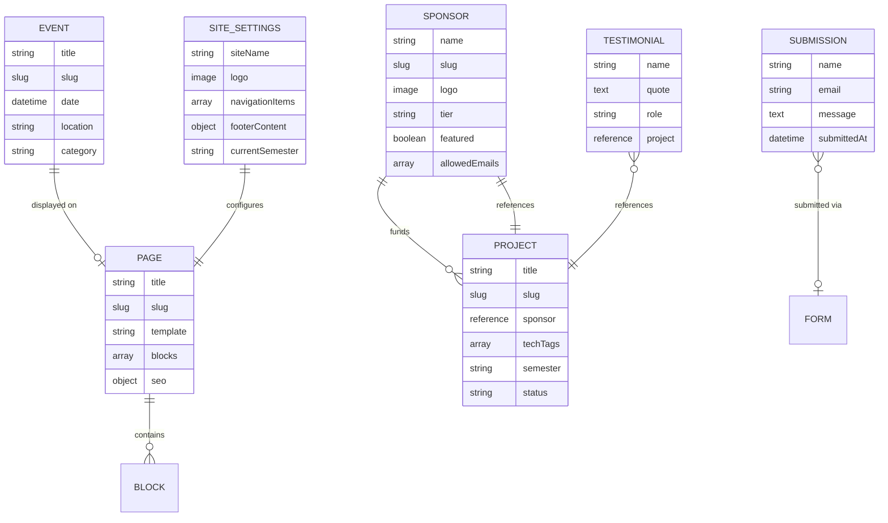
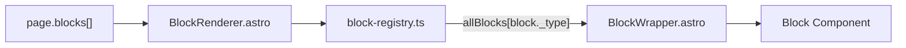
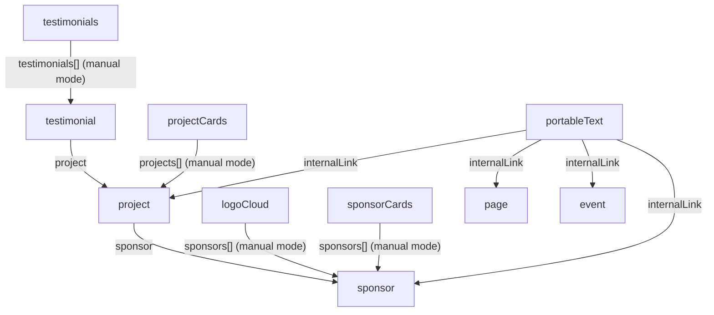

All CMS content lives in **Sanity Content Lake**. The schema is organized into three layers: **documents** (top-level content), **objects** (reusable field groups), and **blocks** (page builder sections).

## Entity-relationship diagram

## Document types

### page

The core page builder document. Each page holds an ordered `blocks[]` array that the `BlockRenderer` dispatches at render time.

| Field | Type | Required | Notes |
|---|---|---|---|
| title | string | Yes | Page title |
| slug | slug | Yes | URL path (source: title) |
| site | string | Conditional | `rwc-us` or `rwc-intl`; hidden on production dataset |
| template | string | No | `default`, `fullWidth`, `landing`, `sidebar`, `twoColumn` |
| seo | seo object | No | Meta title, description, OG image |
| blocks | array | No | 23 block types supported |

Certain blocks emit a Studio warning when used in constrained templates (`sidebar`, `twoColumn`) because their full-width layouts will not render correctly.

### siteSettings (singleton)

One document per workspace. Controls global navigation, branding, footer, and social links.

| Field | Type | Required | Notes |
|---|---|---|---|
| siteName | string | Yes | Site display name |
| logo | image (with alt) | Yes | Primary logo |
| logoLight | image (with alt) | No | Light-mode variant |
| ctaButton | button object | No | Header call-to-action |
| navigationItems | array of link | No | Main nav with dropdown children |
| footerContent | object | No | Text and copyright string |
| socialLinks | array | No | Platform + URL pairs |
| contactInfo | object | No | Address, email, phone |
| footerLinks | array of link | No | Footer nav |
| resourceLinks | array of link | No | Resource nav |
| programLinks | array of link | No | Program nav |
| currentSemester | string | No | e.g., `"Fall 2026"` |

### sponsor

Industry sponsors with tier-based classification. The `allowedEmails` array is the portal access whitelist — middleware checks it to escalate a user to the `sponsor` role.

| Field | Type | Required | Notes |
|---|---|---|---|
| name | string | Yes | Sponsor organization name |
| slug | slug | Yes | URL path |
| logo | image (with alt) | Yes | Sponsor logo |
| description | text | No | About the sponsor |
| website | url | No | External website |
| contactEmail | string | No | Primary contact (email validated) |
| allowedEmails | array of string | No | Portal whitelist |
| industry | string | No | Industry sector |
| tier | string | No | `platinum`, `gold`, `silver`, `bronze` |
| hidden | boolean | No | Hides sponsor from all public listings |
| featured | boolean | No | Promotes to featured displays |
| seo | seo object | No | SEO metadata |

### project

Capstone projects linked to a sponsor with technology tags and team roster.

| Field | Type | Required | Notes |
|---|---|---|---|
| title | string | Yes | Project title |
| slug | slug | Yes | URL path |
| sponsor | reference → sponsor | No | Funding sponsor |
| status | string | Yes | `active`, `completed`, `archived` |
| featured | boolean | No | Promotes to featured displays |
| semester | string | No | Academic semester label |
| content | portableText | No | Rich text description |
| outcome | text | No | Outcome and impact summary |
| team | array of objects | No | `name` + `role` per member |
| mentor | object | No | `name`, `title`, `department` |
| technologyTags | array of string | No | 70+ predefined technology options |
| seo | seo object | No | SEO metadata |

### testimonial

Quotes from industry partners and students, optionally linked to a project.

| Field | Type | Required | Notes |
|---|---|---|---|
| name | string | Yes | Person's name |
| quote | text | Yes | Testimonial text |
| role | string | No | Job title or role |
| organization | string | No | Company or school |
| type | string | No | `industry` or `student` |
| photo | image (with alt) | No | Person's photo |
| project | reference → project | No | Related project |

### event

Calendar events with categories and optional end dates.

| Field | Type | Required | Notes |
|---|---|---|---|
| title | string | Yes | Event title |
| slug | slug | Yes | URL path |
| date | datetime | Yes | Start date/time |
| endDate | datetime | No | Must be after `date` (validated) |
| location | string | No | Venue |
| description | text | No | Event description |
| isAllDay | boolean | No | Default: `false` |
| category | string | No | `workshop`, `lecture`, `social`, `competition`, `other` |
| eventType | string | No | `showcase`, `networking`, `workshop` |
| status | string | No | `upcoming`, `past` |
| seo | seo object | No | SEO metadata |

### submission (read-only)

Contact form submissions stored by the Cloudflare Worker proxy. This document type is read-only in Studio — entries are created by the API, not by editors.

| Field | Type | Required | Notes |
|---|---|---|---|
| name | string | Yes | Submitter name |
| email | string | Yes | Submitter email |
| organization | string | No | Organization |
| message | text | Yes | Message content |
| form | reference → form | No | Source form |
| submittedAt | datetime | Yes | Submission timestamp |

## Object types

Shared objects are reused across multiple document and block types.

| Object | Fields | Used in |
|---|---|---|
| seo | metaTitle (max 60), metaDescription (max 160), ogImage | page, sponsor, project, event |
| button | text, url (validated), variant (default / secondary / outline / ghost) | ctaBanner, heroBanner, sponsorSteps, sponsorshipTiers |
| link | label, href (validated), external (boolean) | siteSettings nav, footer |
| portableText | h2–h4, blockquote, strong/em/code/underline, internalLink, image with alt+caption, callout with tone | project.content, richText, faqItem.answer, textWithImage |
| faqItem | question, answer (portableText) | faqSection |
| featureItem | icon, image, title, description | featureGrid |
| statItem | value, label, description | statsRow |
| stepItem | title, description, bullet list | sponsorSteps |
| teamMember | name, role, image (with alt), links[] | teamGrid |
| galleryImage | image (with alt), caption | imageGallery |
| comparisonColumn | title, highlighted (boolean) | comparisonTable |
| comparisonRow | feature, values[], isHeader (boolean) | comparisonTable |
| timelineEntry | date, title, description, image (with alt) | timeline |
| block-base | backgroundVariant, spacing, maxWidth | All blocks (via `defineBlock`) |

## How page documents relate to blocks

Every `page` document has a `blocks[]` array. Each element in the array is one of 23 block object types. At build time the `PAGE_BY_SLUG_QUERY` GROQ query expands the full block data. `BlockRenderer.astro` maps `block._type` to the matching component via `block-registry.ts`:

All block components share the same flat-props interface — fields arrive as direct props, not nested under a `block` object.

## Reference graph

## Multi-site support

The platform serves three site variants from a single codebase using two environment variables:

| Variant | `PUBLIC_SANITY_DATASET` | `PUBLIC_SITE_ID` | Theme | Dev port |
|---|---|---|---|---|
| YWCC Capstone | `production` | `capstone` | red | 4321 |
| RWC US | `rwc` | `rwc-us` | blue | 4322 |
| RWC International | `rwc` | `rwc-intl` | green | 4323 |

- `PUBLIC_SANITY_DATASET` selects the Sanity dataset at build time.
- `PUBLIC_SITE_ID` filters documents within the dataset — each document has an optional `site` field used for this purpose.
- `PUBLIC_SITE_THEME` applies CSS custom property overrides via a `[data-site-theme]` attribute.
- The Studio `siteField` enables per-document site assignment; it is hidden on the production dataset (Capstone only).
- Docker Compose can run all three variants simultaneously on separate ports.

<Tip>
  When adding a new document type that should be site-filterable, include the `site` string field and use `createSchemaTypesForWorkspace(targetDataset)` in the schema factory to conditionally show or hide it based on the active dataset.
</Tip>
