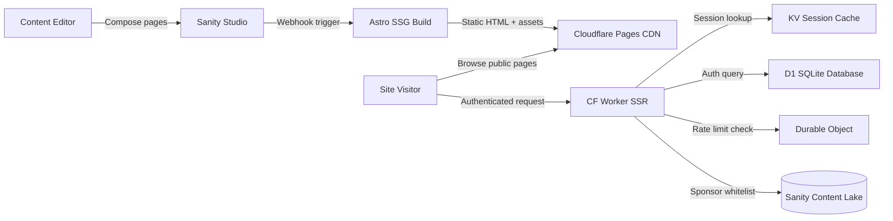
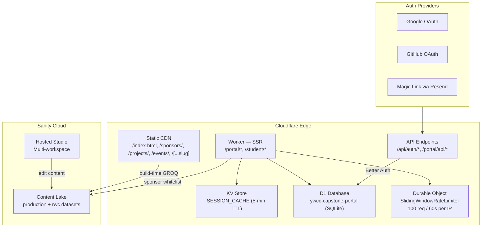

The YWCC Industry Capstone site is a **Jamstack + Selective SSR** monorepo. Public-facing content is pre-rendered at build time into static HTML and served from Cloudflare's CDN. Authenticated portal pages are server-rendered on demand by Cloudflare Workers. Content flows from Sanity Studio through GROQ queries into Astro at build time, with no runtime CMS calls on production.

## System diagram

## Layered architecture

## Key architectural decisions

| Decision | Choice | Rationale |
|---|---|---|
| Rendering strategy | Static-first with per-route SSR | Lighthouse 95+ for public pages; dynamic auth for portal |
| CMS | Sanity (headless) | Visual Editing, structured content, real-time API |
| Deployment | Cloudflare Pages + Workers | Edge computing, D1 database, Durable Objects |
| Auth | Better Auth | Multi-provider (OAuth + Magic Link), D1 adapter |
| Database | Cloudflare D1 (SQLite) | Serverless, zero-config, edge-local |
| Rate limiting | Cloudflare Durable Objects | Per-IP state, SQLite-backed sliding window |
| UI framework | Astro + React islands | Minimal client JS; hydration only where needed |
| Styling | Tailwind CSS v4 | CSS-first config, design tokens, multi-theme |
| Component library | shadcn / fulldev-ui pattern | Copy-paste ownership, 39+ primitive families |

## Public pages (SSG) vs portal pages (SSR)

<CardGroup cols={2}>
  <Card title="SSG — 8 public pages" icon="globe">
    Pre-rendered at build time. Served directly from Cloudflare's CDN. No auth required.

    - `/` — Home (index.astro)
    - `/sponsors/` — Sponsor listing
    - `/sponsors/[slug]` — Sponsor detail
    - `/projects/` — Project listing
    - `/projects/[slug]` — Project detail
    - `/events/` — Events listing
    - `/events/[slug]` — Event detail
    - `/[...slug]` — CMS-driven pages
  </Card>
  <Card title="SSR — 9 portal/auth pages" icon="lock">
    Server-rendered per request by a Cloudflare Worker. Auth middleware runs on every hit.

    - `/portal/` — Sponsor dashboard
    - `/portal/[sponsorSlug]` — Sponsor-specific view
    - `/portal/events` — Portal events
    - `/portal/progress` — Project progress
    - `/portal/login` — Login screen
    - `/portal/denied` — Access denied
    - `/student/` — Student dashboard
    - `/auth/login` — Auth entry
    - `/api/auth/*` — Better Auth handler (5 endpoints)
  </Card>
</CardGroup>

## Cloudflare edge services

| Service | Binding | Purpose |
|---|---|---|
| Cloudflare Pages | — | Hosts static HTML/CSS/JS from the CDN |
| Cloudflare Workers | Bundled with Pages | Runs SSR pages and API endpoints at the edge |
| D1 (SQLite) | `PORTAL_DB` | Stores user accounts, sessions, OAuth accounts, magic-link verification tokens |
| KV | `SESSION_CACHE` | Caches validated sessions for 5 minutes to avoid D1 round trips |
| Durable Objects | `rate-limiter-worker` | Per-IP sliding window: 100 requests / 60 s; alarm-based cleanup |

<Note>
  The `output: 'static'` setting in `astro.config.mjs` is the project default. Pages that need SSR opt in individually via `export const prerender = false`. The `@astrojs/cloudflare` adapter bridges both modes under a single Cloudflare Pages project.
</Note>

## Performance targets

| Metric | Target |
|---|---|
| Lighthouse Performance | 95+ |
| Lighthouse Accessibility | 90+ |
| Cumulative Layout Shift | < 0.05 |
| JS payload | < 5 KB minified |
| CSS payload | < 15 KB after Tailwind purge |

No framework runtime ships to the browser — Total Blocking Time stays near zero because Astro outputs plain HTML by default and only hydrates React islands in the portal.
