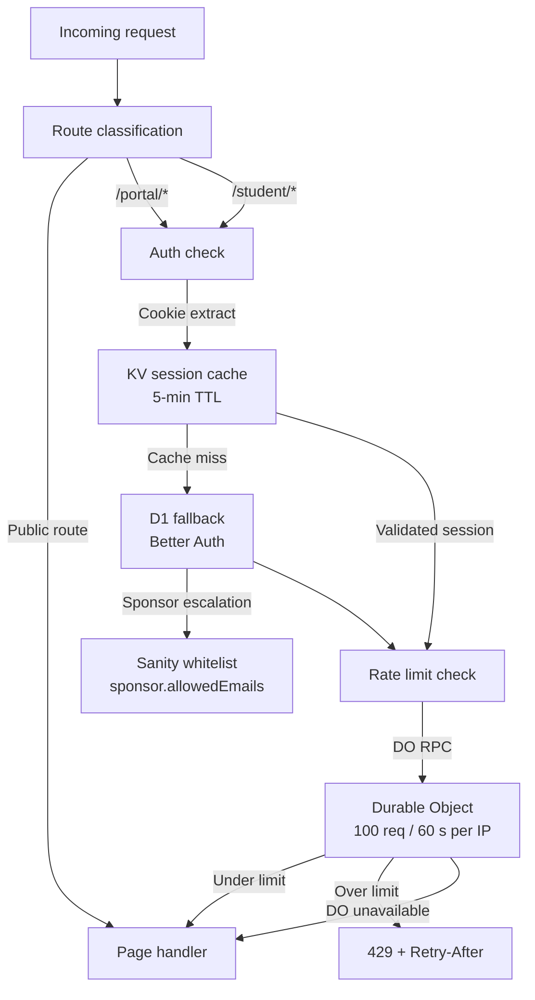

The project uses Astro's `output: 'static'` globally, then opts specific routes into server-side rendering with `export const prerender = false`. This keeps the public site fast (everything from CDN) while still supporting dynamic portal pages that need authentication.

## Rendering modes at a glance

| Mode | Count | Routes | Rendering trigger |
|---|---|---|---|
| SSG | 8 pages | Public site, sponsors, projects, events | Build time |
| SSR | 9 pages | Portal, student dashboard, auth | Request time |
| API | 5 endpoints | Better Auth, events API, subscribe | Request time |

## Static generation (SSG) — public pages

All public pages are pre-rendered during the Cloudflare Pages build. Content is fetched from Sanity via GROQ at build time and baked into static HTML. There are no runtime API calls from a browser visiting the public site.

| File | Route | Static path source |
|---|---|---|
| `index.astro` | `/` | Hardcoded |
| `sponsors/index.astro` | `/sponsors/` | Hardcoded |
| `sponsors/[slug].astro` | `/sponsors/[slug]` | `ALL_SPONSOR_SLUGS_QUERY` |
| `projects/index.astro` | `/projects/` | Hardcoded |
| `projects/[slug].astro` | `/projects/[slug]` | `ALL_PROJECT_SLUGS_QUERY` |
| `events/index.astro` | `/events/` | Hardcoded |
| `events/[slug].astro` | `/events/[slug]` | `ALL_EVENT_SLUGS_QUERY` |
| `[...slug].astro` | `/<any-cms-slug>` | `ALL_PAGE_SLUGS_QUERY` |

Slug-based pages export a `getStaticPaths()` function that queries Sanity for all published slugs. Each slug becomes a separate pre-rendered HTML file on the CDN.

## Server-side rendering (SSR) — portal and auth

Portal pages export `export const prerender = false`, which tells the `@astrojs/cloudflare` adapter to route those requests through a Cloudflare Worker instead of the CDN. The Worker runs the Astro render pipeline on every request.

| File | Route | Required role |
|---|---|---|
| `portal/index.astro` | `/portal/` | sponsor |
| `portal/[sponsorSlug].astro` | `/portal/[sponsorSlug]` | sponsor |
| `portal/events.astro` | `/portal/events` | sponsor |
| `portal/progress.astro` | `/portal/progress` | sponsor |
| `portal/login.astro` | `/portal/login` | none (public) |
| `portal/denied.astro` | `/portal/denied` | none (public) |
| `student/index.astro` | `/student/` | student |
| `auth/login.astro` | `/auth/login` | none (public) |
| `api/auth/[...all].ts` | `/api/auth/*` | none (Better Auth) |

## Middleware pipeline

Every request to an SSR route passes through the middleware pipeline before the page handler runs:



### Auth check detail

1. Middleware extracts the session token from the request cookie.
2. It checks `SESSION_CACHE` KV for a cached session (5-minute TTL).
3. On cache miss, it queries D1 via Better Auth.
4. If the user's email is in `sponsor.allowedEmails` (checked against Sanity), the role is escalated to `sponsor`.
5. The validated user is placed in `Astro.locals.user` for the page handler.
6. Non-whitelisted users receive the `student` role and are redirected if they try to access `/portal/*`.

### Rate limit detail

- Implemented as a Cloudflare Durable Object (`SlidingWindowRateLimiter`).
- Limit: 100 requests per 60 seconds per IP address.
- Uses SQLite storage within the DO for the sliding window counter.
- Alarm-based cleanup removes stale rate limit records.
- **Fail-open:** if the Durable Object is unavailable, the request proceeds normally.

## SSR on the preview branch — Visual Editing

The `preview` Git branch deploys to Cloudflare Pages with these additional environment variables:

```bash
PUBLIC_SANITY_VISUAL_EDITING_ENABLED=true
PUBLIC_SANITY_LIVE_CONTENT_ENABLED=true
```

With Visual Editing enabled:

- The Sanity client switches from the CDN (`useCdn: true`) to the live API (`useCdn: false`).
- Stega encoding embeds click-to-edit metadata in rendered strings.
- The Presentation tool in Sanity Studio loads the preview URL as an iframe with an overlay that maps visible elements back to their Studio fields.
- Draft content (unpublished changes) is visible on the preview URL.

<Note>
  Visual Editing is **never** active on `main`. The production build always uses `useCdn: true` and bakes published content only.
</Note>

## How webhooks trigger rebuilds

<Steps>
  <Step title="Editor publishes content in Sanity Studio">
    Publishing a document (or unpublishing, deleting) triggers a Sanity webhook.
  </Step>
  <Step title="Webhook hits Cloudflare Pages deploy hook">
    Sanity sends a POST request to the Cloudflare Pages deploy hook URL configured in the project dashboard.
  </Step>
  <Step title="Cloudflare Pages triggers a new build">
    The build runs `npm run build --workspace=astro-app`, which fetches all content via GROQ and pre-renders every SSG page.
  </Step>
  <Step title="New static assets are deployed to the CDN">
    Cloudflare atomically swaps the CDN cache with the new build output. Visitors immediately see updated content.
  </Step>
</Steps>

<Tip>
  Because every publish triggers a full rebuild, content editors do not need to know which page a block appears on. The build always fetches everything fresh.
</Tip>
