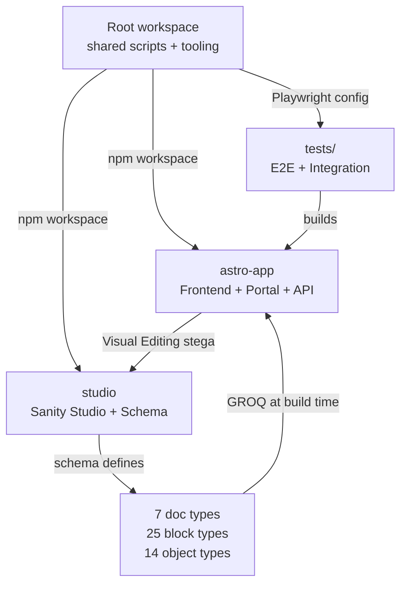

The repository is configured as an **npm workspaces monorepo**. The root `package.json` declares two workspace packages:

```json
{
  "workspaces": ["astro-app", "studio"]
}
```

Running `npm install` at the repo root hoists shared dependencies and installs both packages in a single pass.

## astro-app

The Astro frontend. Responsible for all public pages, the authenticated portal, block rendering, and Cloudflare edge integration.

| Area | Location | Description |
|---|---|---|
| Pages | `src/pages/` | SSG public routes and SSR portal routes |
| Block components | `src/components/blocks/` | 100+ fulldev/ui template variants |
| Custom blocks | `src/components/blocks/custom/` | 23 CMS-connected blocks with business logic |
| UI primitives | `src/components/ui/` | shadcn-style component copies (owned, not a dependency) |
| Portal components | `src/components/portal/` | 8 React-hydrated components for the sponsor portal |
| Block registry | `src/components/block-registry.ts` | Auto-discovers all block components via `import.meta.glob()` |
| Block renderer | `src/components/BlockRenderer.astro` | Single dispatch: `block._type` → spread props |
| GROQ queries | `src/lib/sanity.ts` | All queries using `defineQuery()` + block resolver functions |
| Auth database | `src/lib/drizzle-schema.ts` | Drizzle ORM schema for Cloudflare D1 |
| Styles | `src/styles/global.css` | `@import "tailwindcss"` + CSS custom properties + theme tokens |
| Config | `astro.config.mjs` | Build config, integrations, multi-site env vars |

### Key dependencies

| Package | Role |
|---|---|
| `astro` | Core framework (SSG + SSR) |
| `@astrojs/cloudflare` | Cloudflare Pages/Workers adapter |
| `@sanity/astro` | Sanity client integration + Visual Editing |
| `@astrojs/react` | React island support for portal components |
| `@tailwindcss/vite` | Tailwind CSS v4 via Vite plugin |
| `better-auth` | Authentication (OAuth + Magic Link) |
| `drizzle-orm` | Type-safe ORM for Cloudflare D1 |
| `nanostores` | Lightweight state store for React portal components |
| `@iconify/utils` | Icon resolution for Lucide and Simple Icons |

## studio

Sanity Studio v5. Responsible for content editing, schema definition, and Visual Editing presentation.

| Area | Location | Description |
|---|---|---|
| Document schemas | `src/schemaTypes/documents/` | 7 top-level document types |
| Block schemas | `src/schemaTypes/blocks/` | 25 page builder block object schemas |
| Object schemas | `src/schemaTypes/objects/` | 14 shared reusable field groups |
| Schema factory | `src/schemaTypes/helpers/defineBlock.ts` | Merges `block-base` into every block |
| Schema index | `src/schemaTypes/index.ts` | Exports all types; applies multi-workspace filtering |

### Key dependencies

| Package | Role |
|---|---|
| `sanity` | Core Sanity Studio SDK |
| `@sanity/vision` | GROQ query tester in Studio |

## Root workspace

The root `package.json` is not a publishable package. It owns shared developer tooling and orchestrates both child packages.

| Area | Location | Description |
|---|---|---|
| E2E tests | `tests/` | Playwright test suites |
| Playwright config | `playwright.config.ts` | 5 browser projects, axe-core, base URL |
| Release config | `.releaserc.json` | semantic-release: version bump, changelog, GitHub Release, preview sync |
| Changelog | `CHANGELOG.md` | Auto-generated; do not edit manually |
| CI/CD | `.github/workflows/` | ci, release, sync-preview, deploy-storybook, enforce-preview-only |
| Dev docs | `docs/` | Architecture and team guides |

### Root scripts

| Command | What it does |
|---|---|
| `npm run dev` | Starts Astro dev server + Sanity Studio concurrently |
| `npm run dev:storybook` | Starts Astro + Studio + Storybook (all three) |
| `npm run storybook` | Starts Storybook alone on port 6006 |
| `npm run test:unit` | Runs Vitest unit tests |
| `npm run test:unit:watch` | Vitest in watch mode |
| `npm run test` | Builds then runs all Playwright E2E tests |
| `npm run test:integration` | Playwright integration tests (no browser) |
| `npm run test:ui` | Playwright in interactive UI mode |

## How packages relate



- `studio` defines the content schema. `astro-app` consumes it at build time via GROQ queries.
- `astro-app` embeds stega metadata in rendered strings so Sanity Studio's Presentation tool can map visible elements back to their schema fields.
- The root workspace orchestrates both: `npm run dev` starts both dev servers via `concurrently`, and `npm run test` builds `astro-app` before running Playwright.

## npm workspace command patterns

Run a script in a specific package:

```bash
# Build only the Astro app
npm run build --workspace=astro-app

# Deploy only Sanity Studio
npx sanity deploy --workspace=studio
```

Install a dependency into a specific package:

```bash
# Add a dependency to astro-app only
npm install some-package --workspace=astro-app

# Add a dev dependency to the root (shared tooling)
npm install -D some-tool
```

<Warning>
  Never run `npm install` inside a child package directory. Always run it from the repo root so the workspace hoisting stays consistent and both lockfiles remain in sync.
</Warning>
