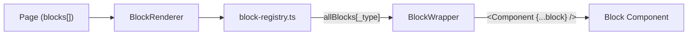

The block library is the core of the YWCC Capstone page-building system. Content editors compose every page in Sanity Studio by stacking blocks — no code required. Developers add new blocks without touching any existing code.

## What is a block?

A block is a self-contained section of a page: a hero, a feature grid, a contact form, a stats row. Each block:

- Has its own **Sanity schema** (the fields editors fill in)
- Has its own **Astro component** (the rendered output)
- Receives its data as **flat spread props** — no wrapper objects
- Is controlled by the **block registry**, which maps `_type` strings to components

Pages hold a flat array of blocks. There are no nested blocks.

## Two categories of blocks

<CardGroup cols={2}>
  <Card title="Custom blocks" icon="code" href="/blocks/block-architecture">
    **22 blocks** in `blocks/custom/`. Built for the YWCC Capstone program with business logic, Sanity document references, and Portable Text. Fully CMS-connected.
  </Card>
  <Card title="Template blocks" icon="layer-group" href="/blocks/templates/overview">
    **102 variants** in `blocks/`. Pre-built [fulldev/ui](https://ui.full.dev) design variants installed via the shadcn CLI. Sanity wiring is in progress (Stories 2.4–2.8).
  </Card>
</CardGroup>

### Custom blocks

These 22 blocks live in `astro-app/src/components/blocks/custom/` and have complete Sanity schema + GROQ projections:

| Block | `_type` | Description |
|---|---|---|
| Hero Banner | `heroBanner` | Heading, subheading, background image carousel, CTA buttons, 5 layout variants |
| Feature Grid | `featureGrid` | Icon/image + title + description cards, configurable columns |
| Sponsor Cards | `sponsorCards` | Sponsor documents with tier badges and display modes |
| Rich Text | `richText` | Portable Text with inline images and callout boxes |
| CTA Banner | `ctaBanner` | Heading, description, action buttons, 4 layout variants |
| FAQ Section | `faqSection` | Expandable Q&A pairs with keyboard accessibility |
| Contact Form | `contactForm` | Configurable fields, server-side submission via Cloudflare Worker |
| Stats Row | `statsRow` | Heading + stat cards with dark/light variant support |
| Text with Image | `textWithImage` | Portable text alongside a positioned image |
| Logo Cloud | `logoCloud` | Sponsor logos from Sanity sponsor documents |
| Sponsor Steps | `sponsorSteps` | Numbered step-by-step process cards |
| Testimonials | `testimonials` | Testimonial cards from Sanity testimonial documents |
| Event List | `eventList` | Upcoming events from Sanity event documents |
| Project Cards | `projectCards` | Project documents with sponsor references |
| Team Grid | `teamGrid` | Team member cards |
| Image Gallery | `imageGallery` | Grid or masonry image layouts |
| Article List | `articleList` | Article listing with metadata |
| Comparison Table | `comparisonTable` | Column-based feature comparison |
| Timeline | `timeline` | Chronological entry list |
| Pullquote | `pullquote` | Large-format editorial quotation |
| Divider | `divider` | Visual separator with spacing options |
| Announcement Bar | `announcementBar` | Top-of-section notice bar |

### Template blocks

102 pre-built design variants across 12 categories, installed via `npx shadcn@latest add @fulldev/{name}`:

| Category | Count | Examples |
|---|---|---|
| Heroes | 14 | `hero-1` through `hero-14` |
| Features | 6 | `features-1` through `features-6` |
| Content | 6 | `content-1` through `content-6` |
| CTA | 8 | `cta-1` through `cta-8` |
| Pricing | 3 | `pricings-1` through `pricings-3` |
| Reviews | 5 | `reviews-1` through `reviews-5` |
| Services | 7 | `services-1` through `services-7` |
| Articles | 6 | `article-1`, `articles-1` through `articles-4` |
| Media | 9 | `logos-*`, `images-*`, `video-*`, `videos-*` |
| Navigation | 6 | `header-1` through `header-3`, `footer-1` through `footer-3` |
| FAQ/Steps | 7 | `faqs-1` through `faqs-4`, `steps-1` through `steps-3` |
| Misc | 25 | `banner-*`, `stats-*`, `contact-*`, `links-*`, `table-1` |

<Note>
  Template blocks have Storybook stories with demo data. Connecting them to Sanity follows the adapter pattern described in the [wiring guide](/blocks/adding/template-block).
</Note>

## How blocks compose into pages

A Sanity `page` document holds a `blocks[]` array. At build time, Astro fetches the page with a GROQ query that projects each block's fields into flat props. `BlockRenderer` iterates the array, looks up each block's component in the registry by `_type`, and renders it:

**`BlockWrapper`** handles the layout context shared by every block — background color, vertical spacing, and max-width — using three Sanity-controlled fields present on every block schema: `backgroundVariant`, `spacing`, and `maxWidth`.

## Next steps

<CardGroup cols={2}>
  <Card title="Block architecture" icon="sitemap" href="/blocks/block-architecture">
    The flat-props interface pattern, filename–type mapping, and auto-discovery mechanics.
  </Card>
  <Card title="Block registry" icon="table" href="/blocks/block-registry">
    The full `block-registry.ts` source and how BlockRenderer dispatches to components.
  </Card>
  <Card title="Adding a custom block" icon="plus" href="/blocks/adding/custom-block">
    Step-by-step guide for building a new CMS-connected block.
  </Card>
  <Card title="Wiring a template block" icon="plug" href="/blocks/adding/template-block">
    Connect an existing fulldev/ui template to Sanity without touching the .astro file.
  </Card>
</CardGroup>
