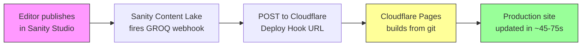

The Astro frontend deploys to **Cloudflare Pages** via native git integration. Every push triggers a build; the branch name determines which environment is targeted.

## Deployment environments

<CardGroup cols={2}>
  <Card title="Production" icon="globe">
    **Branch:** `main`

    Static output (`output: "static"`), Visual Editing **OFF**. All public pages are pre-rendered to static HTML at build time and served from Cloudflare's edge CDN with zero Worker invocations.
  </Card>
  <Card title="Preview / Staging" icon="eye">
    **Branch:** any branch other than `main`

    SSR enabled via `@astrojs/cloudflare` adapter, Visual Editing **ON** with draft content from Sanity. Each branch gets a unique preview URL: `branch-name.ywcc-capstone.pages.dev`.
  </Card>
</CardGroup>

<Note>
  The `preview` branch acts as the staging environment. It deploys to `preview.ywcc-capstone.pages.dev` with SSR and Visual Editing enabled so editors can review draft content before it ships.
</Note>

## How it works

Content rebuilds use a **Cloudflare deploy hook** — the simplest possible pipeline with no GitHub Actions in the loop.



| Trigger | Result |
|---|---|
| Push to `main` (or merged PR) | Production deploy to `ywcc-capstone.pages.dev` |
| Push to any other branch | Preview deploy to `branch.ywcc-capstone.pages.dev` |
| Sanity content published | Deploy hook fires → production rebuild |

## Build configuration

| Setting | Value |
|---|---|
| Framework preset | Astro |
| Build command | `npm install --prefer-offline --no-audit --no-fund && npm run build --workspace=astro-app` |
| Build output directory | `astro-app/dist` |
| Root directory | `/` (monorepo root — npm workspaces require the root `package.json`) |

<Warning>
  Root directory **must** be `/`, not `astro-app/`. The build command uses npm workspaces which requires the monorepo root `package.json` to resolve all workspace packages.
</Warning>

## Create the Pages project

<Steps>
  <Step title="Connect the repository">
    Go to [dash.cloudflare.com](https://dash.cloudflare.com) → **Workers & Pages** → **Create** → **Pages** → **Connect to Git** → select the `astro-shadcn-sanity` repo.
  </Step>
  <Step title="Configure the build">
    Set the project name to `ywcc-capstone`, build command, and output directory as shown in the table above.
  </Step>
  <Step title="Set environment variables">
    Add all required environment variables (see section below) before saving. Variables set here are available at build time and runtime.
  </Step>
  <Step title="Deploy">
    Click **Save and Deploy**. The first build will run immediately. Subsequent builds trigger automatically on every git push.
  </Step>
</Steps>

## Environment variables

Set these in **CF Pages → ywcc-capstone → Settings → Environment variables** for both **Production** and **Preview** environments.

### Public variables (plaintext)

| Variable | Value | Description |
|---|---|---|
| `PUBLIC_SANITY_STUDIO_PROJECT_ID` | `49nk9b0w` | Sanity project ID |
| `PUBLIC_SANITY_DATASET` | `production` | Sanity dataset to query at build time |
| `PUBLIC_SITE_ID` | `capstone` | Used for GROQ filtering via `getSiteParams()` |
| `PUBLIC_SITE_THEME` | `red` | Sets `data-site-theme` on `<html>` for CSS overrides |
| `PUBLIC_SITE_URL` | `https://ywcc-capstone.pages.dev` | Canonical site URL |
| `PUBLIC_SANITY_STUDIO_URL` | Studio URL | URL of the deployed Sanity Studio |
| `PUBLIC_GTM_ID` | GTM container ID | Google Tag Manager container (baked in at build time) |
| `PUBLIC_SANITY_VISUAL_EDITING_ENABLED` | `true` | Enables Visual Editing overlay |
| `PUBLIC_TURNSTILE_SITE_KEY` | Turnstile site key | Cloudflare Turnstile widget (client-side, baked at build) |
| `SKIP_DEPENDENCY_INSTALL` | `true` | Skips CF Pages automatic `npm clean-install`, uses build cache |
| `NODE_VERSION` | `24.13.1` | Pinned Node.js version for build cache reuse |

### Secrets (encrypted)

| Variable | Description |
|---|---|
| `CF_ACCESS_AUD` | Access Application Audience tag (64-char hex) — used for JWT verification |
| `TURNSTILE_SECRET_KEY` | Turnstile server-side verification secret |
| `SANITY_API_WRITE_TOKEN` | Sanity write token for form submissions (Editor role) |
| `DISCORD_WEBHOOK_URL` | Discord webhook URL for form submission notifications |

### GitHub Actions secrets (CI only)

| Secret | Description |
|---|---|
| `CLOUDFLARE_API_TOKEN` | API token with `Cloudflare Pages: Edit` permission |
| `CLOUDFLARE_ACCOUNT_ID` | Cloudflare account ID |
| `SANITY_API_READ_TOKEN` | Sanity read token for build-time content fetching |

## Multi-project deployment

The same Astro codebase deploys as **three independent CF Pages projects**, each with different environment variables:

| CF Pages Project | Dataset | Site ID | Theme | URL |
|---|---|---|---|---|
| `ywcc-capstone` | `production` | `capstone` | `red` | `ywcc-capstone.pages.dev` |
| `rwc-us` | `rwc` | `rwc-us` | `blue` | `rwc-us.pages.dev` |
| `rwc-intl` | `rwc` | `rwc-intl` | `green` | `rwc-intl.pages.dev` |

All three share the same repo, build command, and output directory. Only the environment variables differ. No code branching per site — `PUBLIC_SITE_ID` controls GROQ filtering and `PUBLIC_SITE_THEME` controls the CSS theme.

## Build caching

Cloudflare Pages caches build outputs across deployments. The `SKIP_DEPENDENCY_INSTALL=true` environment variable tells the CF Pages v3 build image to skip the automatic `npm clean-install` step (which would delete and reinstall all packages from scratch every build).

| Scenario | Build Time |
|---|---|
| Cold start (no cache) | ~3m 24s |
| Warm (with build cache) | ~2m |
| Fully cached `node_modules` | ~45-75s |

**What gets cached:**

| Cache | Directory | Effect |
|---|---|---|
| npm global cache | `.npm` | `npm install` pulls packages from local cache |
| Astro build cache | `node_modules/.astro` | Incremental Astro builds |

<Tip>
  Build cache expires after 7 days without a build. If `node_modules` is cold and `SKIP_DEPENDENCY_INSTALL=true`, the build may fail. Temporarily remove the variable to force a full install and repopulate the cache, then re-add it.
</Tip>

## Build watch paths

Configured per project to avoid unnecessary rebuilds:

- **Include:** `astro-app/*`, `package-lock.json`
- **Exclude:** `studio/*`, `_templates/*`, `docs/*`, `tests/*`, `.github/*`, `CHANGELOG.md`, `README.md`

Schema changes in `studio/` don't trigger builds directly. Running `npm run typegen` updates `astro-app/src/sanity.types.ts`, which is in the watch path.

## Set up the deploy hook

<Steps>
  <Step title="Create the hook">
    CF Pages → `ywcc-capstone` → **Settings** → **Builds & deployments** → **Deploy hooks** → **Add deploy hook**.

    Name: `Sanity Content Publish`, Branch: `main` → **Save**. Copy the generated URL — treat it as a secret.
  </Step>
  <Step title="Configure the Sanity webhook">
    [sanity.io/manage](https://sanity.io/manage) → your project → **API** → **Webhooks** → create or edit the webhook:

    | Field | Value |
    |---|---|
    | URL | The deploy hook URL from above |
    | Trigger on | Create, Update, Delete |
    | Filter | `_type in ["page", "siteSettings", "sponsor", "project", "team", "event"]` |
    | Drafts | OFF (only fire on publish, not draft saves) |
    | HTTP method | POST |
  </Step>
  <Step title="Verify">
    Publish a content change in Sanity Studio. Check **sanity.io/manage → Webhooks → Attempts** tab for a `200 OK` response, then check CF Pages dashboard for a new production build.
  </Step>
</Steps>

## Security headers

`astro-app/public/_headers` applies these response headers on all routes via Cloudflare Pages CDN:

```text
/*
  X-Content-Type-Options: nosniff
  Referrer-Policy: strict-origin-when-cross-origin
  Permissions-Policy: camera=(), microphone=(), geolocation=()
  Content-Security-Policy: frame-ancestors 'self' https://*.sanity.studio https://*.sanity.io
```

<Note>
  These headers are only active on deployed Cloudflare Pages. They do not apply in local `wrangler pages dev` or `astro dev`.
</Note>

## Local Wrangler preview

To preview the production build locally using Miniflare:

```bash
npm run build --workspace=astro-app
cd astro-app && npx wrangler pages dev dist/
```

Runs on `http://localhost:8788`.

## Troubleshooting

| Problem | Fix |
|---|---|
| Build fails: "Invalid binding `SESSION`" | Informational warning from the Cloudflare adapter. Does not affect static builds — safe to ignore. |
| `_headers` not showing in response | Verify `astro-app/public/_headers` exists and `dist/_headers` is present after build. Only active on deployed CF Pages. |
| Build slow (~3+ minutes) | Ensure `SKIP_DEPENDENCY_INSTALL=true` is set in both Production and Preview environment variables. |
| Webhook shows 403 | Deploy hook URL is wrong or was deleted. Recreate in CF Pages dashboard and update the Sanity webhook URL. |
| Webhook shows 200 but no build appears | Confirm the deploy hook targets the `main` branch and CF Pages has git integration active. |
| Content stale after publish | Brief CDN propagation delay. Wait 30 seconds and hard-refresh. |
