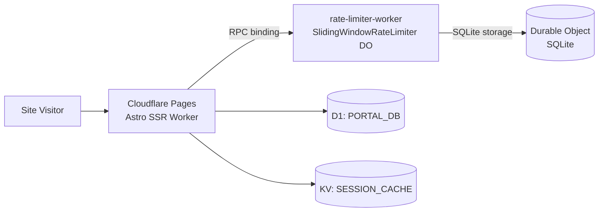

The `rate-limiter-worker/` package is a standalone Cloudflare Worker that provides IP-based rate limiting via a SQLite-backed Durable Object. It must be deployed before the main Astro app.

## Architecture

The main Astro Pages app cannot export Durable Object classes — Cloudflare Pages Functions have that restriction. The rate limiter is therefore hosted in a **separate Worker** and bound to the main app via a Durable Object RPC binding.



## SlidingWindowRateLimiter

The `SlidingWindowRateLimiter` class extends `DurableObject` and uses SQLite-backed storage (available on all plans). Each unique IP gets its own Durable Object instance — Cloudflare routes requests to the geographically nearest instance automatically.

### Rate limit parameters

| Parameter | Value | Description |
|---|---|---|
| `windowMs` | 60,000 ms | 60-second sliding window |
| `maxRequests` | 100 | Maximum requests per window per IP |
| Algorithm | Sliding window | Counts actual timestamps, not fixed buckets |

### How it works

The Durable Object maintains a `requests` table in SQLite:

```sql
CREATE TABLE IF NOT EXISTS requests (
  id INTEGER PRIMARY KEY,
  timestamp_ms INTEGER NOT NULL
);
CREATE INDEX IF NOT EXISTS idx_requests_ts ON requests(timestamp_ms);
```

On each `checkLimit` call:

1. Expired entries (outside the sliding window) are pruned with a single `DELETE`
2. Current window count is fetched with `COUNT(*)`
3. If count ≥ `maxRequests`: returns `{ allowed: false, remaining: 0, retryAfterMs }`
4. Otherwise: inserts the current timestamp and returns `{ allowed: true, remaining: N }`

A Durable Object alarm is scheduled to prune the table after the window expires, allowing the DO to hibernate automatically when idle.

### Response interface

```typescript
export interface RateLimitResult {
  allowed: boolean;
  remaining: number;
  retryAfterMs: number;
}
```

## wrangler.jsonc configuration

```json
{
  "name": "rate-limiter-worker",
  "main": "src/index.ts",
  "compatibility_date": "2025-12-01",
  "compatibility_flags": ["nodejs_compat"],
  "durable_objects": {
    "bindings": [
      {
        "name": "RATE_LIMITER",
        "class_name": "SlidingWindowRateLimiter"
      }
    ]
  },
  "migrations": [
    {
      "tag": "v1",
      "new_sqlite_classes": ["SlidingWindowRateLimiter"]
    }
  ],
  "observability": { "enabled": true }
}
```

The `migrations` block with `new_sqlite_classes` registers `SlidingWindowRateLimiter` as an SQLite-backed Durable Object. This migration runs once on first deploy.

## Main app bindings

The main app (`astro-app/wrangler.jsonc`) references the rate limiter via a cross-script Durable Object binding:

```json
{
  "durable_objects": {
    "bindings": [
      {
        "name": "RATE_LIMITER",
        "class_name": "SlidingWindowRateLimiter",
        "script_name": "rate-limiter-worker"
      }
    ]
  }
}
```

The `script_name` field tells the Pages Worker to find the Durable Object class in the deployed `rate-limiter-worker` script.

## D1 database (PORTAL_DB)

The main app is bound to a D1 database for the sponsor portal:

```json
{
  "d1_databases": [
    {
      "binding": "PORTAL_DB",
      "database_name": "ywcc-capstone-portal",
      "database_id": "76887418-c356-46d8-983b-fa6e395d8b16"
    }
  ]
}
```

| Binding | Purpose |
|---|---|
| `PORTAL_DB` | Sponsor portal data: RSVPs, agreements, notification prefs, evaluations |

**Access pattern in SSR routes:**

```typescript
// Available via Astro.locals.runtime.env in SSR pages
const { PORTAL_DB } = Astro.locals.runtime.env;
const result = await PORTAL_DB.prepare('SELECT * FROM event_rsvps WHERE sponsor_email = ?')
  .bind(email)
  .all();
```

<Tip>
  Use `db.batch()` to combine multiple D1 queries into a single round-trip. Each `batch()` call counts as one subrequest against the 50/request free-plan limit (1,000 on paid plan).
</Tip>

## KV store (SESSION_CACHE)

A KV namespace is bound for session caching:

```json
{
  "kv_namespaces": [
    {
      "binding": "SESSION_CACHE",
      "id": "f78af5695075451c9d3d7887368e90dc"
    }
  ]
}
```

The middleware degrades gracefully if `SESSION_CACHE` is unavailable — sessions fall back to re-validating the JWT on every request.

## Deploy the rate limiter

<Steps>
  <Step title="Authenticate with Cloudflare">
    ```bash
    export CLOUDFLARE_API_TOKEN="your-token-here"
    export CLOUDFLARE_ACCOUNT_ID="your-account-id-here"
    ```
  </Step>
  <Step title="Deploy the worker">
    From the monorepo root:

    ```bash
    npm run deploy:rate-limiter
    ```

    Or from the `rate-limiter-worker/` directory directly:

    ```bash
    npx wrangler deploy
    ```

    The first deploy runs the `v1` migration and creates the `SlidingWindowRateLimiter` SQLite-backed Durable Object class.
  </Step>
  <Step title="Verify deployment">
    ```bash
    curl https://rate-limiter-worker.your-account.workers.dev
    # rate-limiter-worker OK
    ```
  </Step>
  <Step title="Deploy the main app">
    With the rate limiter deployed, the main Astro app can now resolve the `RATE_LIMITER` binding. Deploy or redeploy the `ywcc-capstone` Pages project.
  </Step>
</Steps>

<Warning>
  Deploy the `rate-limiter-worker` **before** the main Astro app. If the `RATE_LIMITER` binding cannot be resolved, the Pages Worker will fail at startup.
</Warning>

## Local development

For local dev, the main app's `wrangler.jsonc` references the rate limiter DO binding. Run Wrangler dev in the `rate-limiter-worker/` directory first, then run `wrangler pages dev` in `astro-app/`:

```bash
# Terminal 1 — start the rate limiter worker
cd rate-limiter-worker && npx wrangler dev

# Terminal 2 — start the main app with Pages dev
cd astro-app && npx wrangler pages dev dist/
```

Alternatively, local dev bypasses auth via the `import.meta.env.DEV` check in `middleware.ts`, so the rate limiter is not exercised in standard `astro dev`.

## Testing

The rate limiter worker has its own Vitest test suite using `@cloudflare/vitest-pool-workers`:

```bash
# From the rate-limiter-worker/ directory
npm test

# Or from monorepo root
npm test --workspace=rate-limiter-worker
```

## Observability

The `rate-limiter-worker` has `observability: { enabled: true }` in `wrangler.jsonc`. Metrics (requests, CPU time, errors) are visible in the **Cloudflare Dashboard → Workers & Pages → rate-limiter-worker → Metrics** tab.
