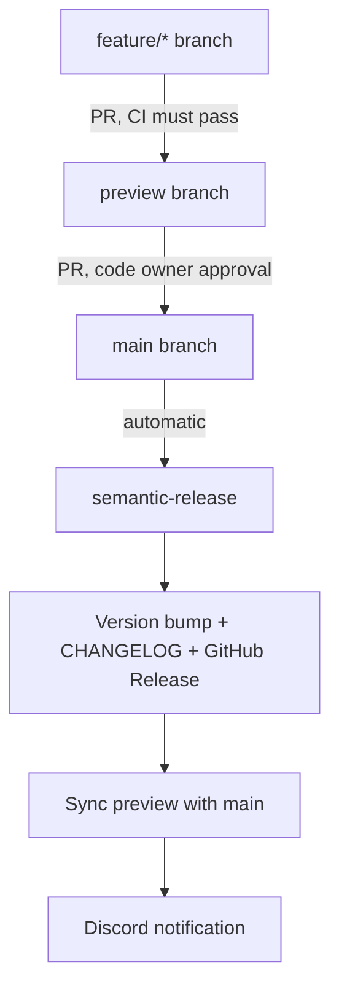

The project uses a three-branch model with [Conventional Commits](https://www.conventionalcommits.org/) and [semantic-release](/deployment/semantic-release) for automated versioning.

## Branch strategy



| Branch | Purpose | Protection |
|---|---|---|
| `main` | Production releases | PRs only from `preview`; code owner approval required |
| `preview` | Staging / integration | PRs only from feature branches; CI must pass |
| `feature/*` | Your working branches | No restrictions |

## Branch protection rules

### main

- Require pull request reviews (code owner approval)
- Require status checks to pass (enforced by `enforce-preview-branch.yml`)
- Only `preview` branch may open a PR to `main` — any other source is rejected by the `enforce-preview-branch.yml` workflow
- Direct pushes disabled

### preview

- Require CI to pass (`unit-tests` and `lighthouse` jobs in `ci.yml`)
- PRs from `main` are blocked by `enforce-preview-source.yml` (the `sync-preview.yml` workflow handles that direction automatically)
- Direct pushes disabled

## Commit format

```text
<type>: <description>
```

Keep the description short and in the imperative mood ("add", "fix", "update" — not "added", "fixed", "updated").

### Conventional commit types

| Prefix | Release? | Version bump | CHANGELOG section |
|---|---|---|---|
| `feat:` | Yes | Minor (0.1.0 → 0.2.0) | Features |
| `fix:` | Yes | Patch (0.1.0 → 0.1.1) | Bug Fixes |
| `feat!:` | Yes | Major (0.1.0 → 1.0.0) | Features |
| `perf:` | Yes | Patch | Performance |
| `chore:` | No | — | Miscellaneous |
| `docs:` | No | — | Documentation |
| `ci:` | No | — | CI/CD |
| `test:` | No | — | Tests |
| `refactor:` | No | — | Refactoring |

**Breaking changes** can be indicated two ways:
- `feat!: rename block prop interface`
- `feat: rename block prop interface\n\nBREAKING CHANGE: Props renamed from camelCase to snake_case`

Both trigger a major version bump.

## PR flow

<Steps>
  <Step title="Branch from preview">
    Always start from the latest `preview` branch:

    ```bash
    git checkout preview
    git pull
    git checkout -b feat/your-feature
    ```
  </Step>
  <Step title="Commit with conventional format">
    ```bash
    git commit -m "feat: add sponsor tier badges to cards"
    git commit -m "fix: correct hero image aspect ratio on mobile"
    ```

    Each commit message must start with a recognized type prefix followed by a colon and space.
  </Step>
  <Step title="Open PR to preview">
    ```bash
    gh pr create --base preview --title "feat: add sponsor tier badges"
    ```

    CI runs automatically:
    - `unit-tests` job: all Vitest tests must pass
    - `lighthouse` job: Lighthouse CI runs against the built site
    - `enforce-preview-source.yml`: confirms the source is not `main`
  </Step>
  <Step title="Merge to preview">
    After CI passes, merge the PR. The feature branch can be deleted.
  </Step>
  <Step title="Open PR to main">
    When the staging environment looks good:

    ```bash
    gh pr create --base main --head preview --title "release: sprint N"
    ```

    The `enforce-preview-branch.yml` workflow verifies the source is `preview`. A code owner review is required.
  </Step>
  <Step title="Merge to main → release happens automatically">
    On merge:
    1. `release.yml` runs semantic-release → version bump, CHANGELOG, GitHub Release
    2. `sync-preview.yml` merges `main` back into `preview`
    3. Discord notification confirms the sync
  </Step>
</Steps>

## Common examples

```bash
# New feature (minor bump)
git commit -m "feat: add FAQ accordion block"

# Bug fix (patch bump)
git commit -m "fix: prevent layout shift on hero carousel"

# Breaking change (major bump)
git commit -m "feat!: rename block _type prefix from snake_case to camelCase"

# No release (chore, docs, test, refactor, ci)
git commit -m "chore: update dependency versions"
git commit -m "docs: add onboarding guide for new team members"
git commit -m "test: add E2E test for contact form submission"
git commit -m "ci: pin Node.js to 24.13.1 in release workflow"
git commit -m "refactor: extract GROQ projections to shared module"
```

## Why this workflow

<CardGroup cols={2}>
  <Card title="preview as integration buffer" icon="filter">
    All feature branches merge to `preview` first. This catches integration issues before they reach production. The preview branch also doubles as the staging environment (SSR + Visual Editing ON).
  </Card>
  <Card title="Automated releases" icon="robot">
    semantic-release eliminates manual version management. The version number is derived from the commit history, making it impossible to forget a version bump or write inconsistent changelog entries.
  </Card>
  <Card title="CI gate" icon="circle-check">
    Unit tests and Lighthouse CI run on every PR to `preview`. Performance regressions are caught before they land in the staging environment, let alone production.
  </Card>
  <Card title="Discord visibility" icon="bell">
    The sync notification tells the whole team when `preview` is safe to branch from again after a release. No need to check the Actions tab.
  </Card>
</CardGroup>

## Troubleshooting

**PR from feature branch to `main` blocked:**
Open a PR to `preview` first, not directly to `main`. The `enforce-preview-branch.yml` workflow blocks all non-`preview` sources.

**PR from `main` to `preview` blocked:**
The `enforce-preview-source.yml` workflow blocks this direction. It is handled automatically by `sync-preview.yml` after every release. No manual PR is needed.

**sync-preview fails with merge conflict:**
A manual merge is required. Checkout `preview`, merge `origin/main`, resolve conflicts, and push. Then manually trigger the Discord notification or post an update to the team.

**semantic-release creates no release:**
All commits since the last tag use non-release prefixes (`chore:`, `docs:`, `ci:`, `test:`, `refactor:`). Add at least one `feat:` or `fix:` commit to trigger a release.
