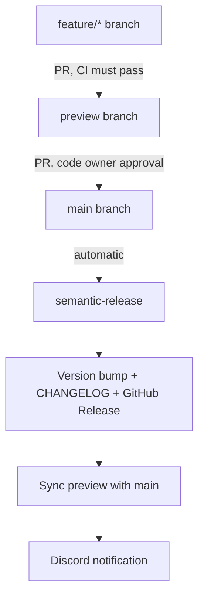

Versioning is fully automated using [semantic-release](https://semantic-release.gitbook.io/). When `preview` merges into `main`, semantic-release analyzes commit messages, determines the version bump, updates `CHANGELOG.md`, creates a git tag, and publishes a GitHub Release — all without any manual steps.

## How it works



## Version bump rules

The version bump is determined by the **highest-impact commit** in the batch merged to `main`:

| Commit prefix | Release? | Version bump | Example |
|---|---|---|---|
| `feat:` | Yes | **Minor** (0.1.0 → 0.2.0) | `feat: add sponsor tier badges` |
| `fix:` | Yes | **Patch** (0.1.0 → 0.1.1) | `fix: correct hero image aspect ratio` |
| `feat!:` or `BREAKING CHANGE:` | Yes | **Major** (0.1.0 → 1.0.0) | `feat!: rename block prop interface` |
| `perf:` | Yes | **Patch** | `perf: lazy-load sponsor logos` |
| `chore:`, `docs:`, `ci:`, `test:`, `refactor:` | No | — | Not included in a release |

If no release-triggering commits are present, semantic-release exits without creating a release.

## What happens on merge to main

<Steps>
  <Step title="Commit analysis">
    `@semantic-release/commit-analyzer` reads all commits since the last tag using the `conventionalcommits` preset. It determines whether a release is needed and what the version bump is.
  </Step>
  <Step title="Release notes generated">
    `@semantic-release/release-notes-generator` builds the changelog body. Commits are grouped by type: Features, Bug Fixes, Performance, Documentation, CI/CD, Tests, Refactoring, Miscellaneous.
  </Step>
  <Step title="CHANGELOG.md updated">
    `@semantic-release/changelog` prepends the new release notes to `CHANGELOG.md`. Do not edit this file manually — it is always overwritten.
  </Step>
  <Step title="package.json version bumped">
    `@semantic-release/npm` updates the `version` field in the root `package.json`. `npmPublish: false` ensures the package is not published to the npm registry.
  </Step>
  <Step title="Changelog committed">
    `@semantic-release/git` commits `CHANGELOG.md` and `package.json` back to `main` with the message:
    ```
    chore(release): 1.2.3 [skip ci]
    ```
    The `[skip ci]` tag prevents an infinite loop of release workflows.
  </Step>
  <Step title="GitHub Release created">
    `@semantic-release/github` creates a GitHub Release with the version tag (e.g., `v1.2.3`) and the generated release notes as the body.
  </Step>
  <Step title="preview branch synced">
    The `sync-preview.yml` workflow runs after the release workflow completes. It merges `main` into `preview` so the next feature branch is based on the released code.
  </Step>
  <Step title="Discord notification">
    A Discord embed confirms the sync:
    > **Preview branch synced** — `preview` is now in sync with `main` at `abc1234`. Safe to pull and branch from preview.
  </Step>
</Steps>

## .releaserc.json

The full configuration:

```json
{
  "branches": ["main"],
  "plugins": [
    ["@semantic-release/commit-analyzer", {
      "preset": "conventionalcommits"
    }],
    ["@semantic-release/release-notes-generator", {
      "preset": "conventionalcommits",
      "presetConfig": {
        "types": [
          { "type": "feat",     "section": "Features" },
          { "type": "fix",      "section": "Bug Fixes" },
          { "type": "perf",     "section": "Performance" },
          { "type": "docs",     "section": "Documentation" },
          { "type": "chore",    "section": "Miscellaneous" },
          { "type": "ci",       "section": "CI/CD" },
          { "type": "test",     "section": "Tests" },
          { "type": "refactor", "section": "Refactoring" }
        ]
      }
    }],
    ["@semantic-release/changelog", {
      "changelogFile": "CHANGELOG.md"
    }],
    ["@semantic-release/npm", {
      "npmPublish": false
    }],
    ["@semantic-release/git", {
      "assets": ["CHANGELOG.md", "package.json"],
      "message": "chore(release): ${nextRelease.version} [skip ci]"
    }],
    "@semantic-release/github"
  ]
}
```

**Key decisions:**

- `branches: ["main"]` — only releases from `main`, never from `preview` or feature branches
- `npmPublish: false` — version bump only, no npm registry publish
- `assets: ["CHANGELOG.md", "package.json"]` — only these two files are committed back by the release
- All 8 commit types appear in release notes (even `chore` and `test`) for full traceability, but only `feat`, `fix`, and `perf` trigger a version bump

## GitHub Actions workflow

The release runs in `.github/workflows/release.yml`:

```yaml
name: Release

on:
  push:
    branches: [main]

permissions:
  contents: write
  issues: write
  pull-requests: write

jobs:
  release:
    runs-on: ubuntu-latest
    steps:
      - uses: actions/checkout@v4
        with:
          fetch-depth: 0
          token: ${{ secrets.RELEASE_TOKEN }}
      - uses: actions/setup-node@v4
        with:
          node-version: 24
      - name: Install semantic-release plugins
        run: npm install --no-save semantic-release @semantic-release/changelog @semantic-release/git @semantic-release/github conventional-changelog-conventionalcommits
      - name: Semantic Release
        env:
          GITHUB_TOKEN: ${{ secrets.RELEASE_TOKEN }}
        run: npx semantic-release
```

<Note>
  `fetch-depth: 0` is required. semantic-release reads the entire git history to find the previous release tag and analyze commits since then. Without the full history, it cannot determine the correct version bump.
</Note>

<Warning>
  `RELEASE_TOKEN` must be a Personal Access Token, not the default `GITHUB_TOKEN`. The release commits a version bump back to `main`, and pushing to a protected branch requires a PAT with `Contents: write` permission.
</Warning>

## CHANGELOG format

The generated `CHANGELOG.md` follows [Keep a Changelog](https://keepachangelog.com/) conventions with sections grouped by commit type. Example:

```markdown
## [1.2.0](https://github.com/gsinghjay/astro-shadcn-sanity/compare/v1.1.0...v1.2.0) (2026-03-15)

### Features

* add sponsor tier badges to cards ([#42](https://github.com/gsinghjay/astro-shadcn-sanity/issues/42)) ([abc1234](https://github.com/gsinghjay/astro-shadcn-sanity/commit/abc1234))

### Bug Fixes

* correct hero image aspect ratio on mobile ([def5678](...))
```

Do not edit `CHANGELOG.md` manually. Every release overwrites it by prepending the new section at the top.
