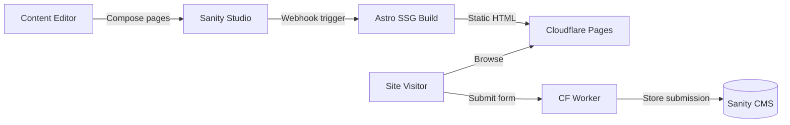

<CardGroup cols={2}>
  <Card title="Quickstart" icon="rocket" href="/quickstart">
    Clone, install, and run both servers in under 5 minutes
  </Card>
  <Card title="Block Library" icon="grid-2" href="/blocks/overview">
    100+ reusable UI blocks — custom and fulldev/ui template blocks
  </Card>
  <Card title="Content Management" icon="pen-to-square" href="/cms/overview">
    Sanity Studio with Visual Editing, structured content, and GROQ queries
  </Card>
  <Card title="Deployment" icon="cloud" href="/deployment/cloudflare-pages">
    Cloudflare Pages + Workers at $0/month operating cost
  </Card>
</CardGroup>

## What is YWCC Capstone?

The YWCC Industry Capstone platform connects NJIT's Ying Wu College of Computing industry sponsors with student capstone teams. Content editors compose pages by stacking reusable blocks in Sanity Studio — no code required. Developers can add new blocks without touching existing code.

## Key features

<CardGroup cols={2}>
  <Card title="CMS page builder" icon="layer-group">
    Stack blocks in Sanity Studio. No developer involvement needed for content changes.
  </Card>
  <Card title="Auto-discovering block registry" icon="magnifying-glass">
    Add a new `.astro` file and it's automatically available in the registry — no switch statements or manual registration.
  </Card>
  <Card title="Lighthouse 95+ performance" icon="gauge-high">
    Static HTML at build time, less than 5KB JS payload, zero runtime API calls.
  </Card>
  <Card title="Visual Editing" icon="eye">
    Preview branch uses SSR so editors see live draft content with overlay controls.
  </Card>
  <Card title="Free hosting" icon="dollar-sign">
    Cloudflare Pages + Workers free tier covers all traffic. Sanity free tier covers CMS.
  </Card>
  <Card title="Automated releases" icon="tag">
    Conventional commits trigger semantic-release: version bump, CHANGELOG, GitHub Release.
  </Card>
</CardGroup>

## Tech stack

| Layer | Technology |
|---|---|
| Frontend | Astro 5.x (SSG, `output: 'static'`) |
| CMS | Sanity 5 (headless, Visual Editing) |
| UI Components | fulldev/ui — vanilla `.astro` components via shadcn CLI |
| Styling | Tailwind CSS v4 (CSS-first config) |
| Hosting | Cloudflare Pages (production: static, preview: SSR) |
| Unit Tests | Vitest (jsdom) |
| E2E Tests | Playwright (5 browser projects + axe-core a11y) |
| CI/CD | GitHub Actions + semantic-release |
| Component Dev | Storybook 10 |

## How content editing works

Content editors never touch code. They open Sanity Studio, create or edit a **Page** document, and compose the page by adding blocks from a library. Each block has clearly labeled fields — no raw JSON or markup required.

<Steps>
  <Step title="Open Sanity Studio">
    Navigate to the Studio URL (local: `http://localhost:3333`, or the deployed Studio URL).
  </Step>
  <Step title="Create or select a page">
    Pages are document types in Sanity. Each page has a title, slug, SEO fields, and a `blocks[]` array.
  </Step>
  <Step title="Add blocks">
    Click **Add item** in the blocks array. Choose from 100+ block types — Hero Banner, Feature Grid, Sponsor Cards, and more.
  </Step>
  <Step title="Publish">
    Click **Publish** in Sanity Studio. A webhook triggers an Astro build on Cloudflare Pages, deploying updated static HTML within minutes.
  </Step>
</Steps>

<Note>
  The **preview** branch uses SSR so Visual Editing overlays work in real time. The **main** branch always builds fully static HTML for maximum performance.
</Note>
