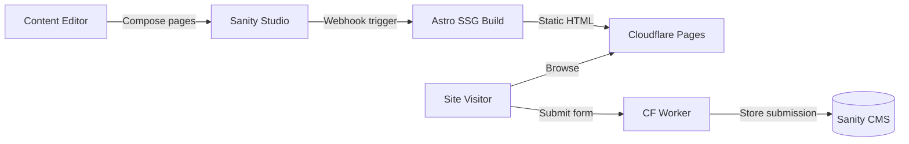

## What is the YWCC Capstone platform?

The YWCC Industry Capstone platform connects industry sponsors with student capstone teams by showcasing sponsor organizations, project proposals, team rosters, and program information for NJIT's Ying Wu College of Computing.

Content editors compose pages by stacking reusable UI blocks in Sanity Studio — zero code required. The site is built with a **toolkit-not-website** approach: a block library maps editor-friendly names to [fulldev/ui](https://ui.full.dev) component internals (vanilla Astro components via the shadcn CLI), making the design system invisible to non-technical users.

**Reference site:** [ywcccapstone1.com](https://ywcccapstone1.com)

## Key goals

- Content editors build and update pages independently with no developer involvement
- Prospective sponsors discover the program and submit inquiries
- Students find team assignments, project details, and key dates in one hub
- $0/month operating cost using free tiers across all services
- Lighthouse 90+ across all categories on every page

## How it works

The platform follows a JAMstack architecture. Sanity Studio serves as the content authoring interface, Astro generates static HTML at build time, and Cloudflare Pages serves those assets globally. A Cloudflare Worker handles form submissions.

Production builds bake all content into static HTML — zero runtime API calls. The `preview` branch uses SSR for live Visual Editing with draft content.

## Tech stack

| Layer | Technology |
|---|---|
| Frontend | [Astro 5.x](https://astro.build/) (SSG, `output: 'static'`) |
| CMS | [Sanity 5](https://www.sanity.io/) (headless, Visual Editing) |
| UI Components | [fulldev/ui](https://ui.full.dev) — vanilla `.astro` components via shadcn CLI |
| Styling | [Tailwind CSS v4](https://tailwindcss.com/) (`@tailwindcss/vite`, CSS-first config) |
| Icons | [@iconify/utils](https://iconify.design/) + Lucide + Simple Icons |
| Interactivity | Vanilla JS (< 5KB total) |
| Hosting | [Cloudflare Pages](https://pages.cloudflare.com/) (production: static, preview: SSR) |
| Form Proxy | [Cloudflare Worker](https://workers.cloudflare.com/) |
| Analytics | GA4 + Monsido |
| Unit Tests | [Vitest](https://vitest.dev/) (jsdom) |
| E2E Tests | [Playwright](https://playwright.dev/) (5 browser projects + axe-core a11y) |
| CI/CD | [GitHub Actions](https://github.com/features/actions) |
| Releases | [semantic-release](https://semantic-release.gitbook.io/) (automated versioning + changelog) |
| Component Dev | [Storybook 10](https://storybook.js.org/) (via `storybook-astro` renderer) |

## Explore the docs

<CardGroup cols={2}>
  <Card title="Quickstart" icon="rocket" href="/quickstart">
    Get the project running locally in under 5 minutes.
  </Card>
  <Card title="Prerequisites" icon="list-check" href="/setup/prerequisites">
    Node.js, accounts, and tools you need before starting.
  </Card>
  <Card title="Environment variables" icon="key" href="/setup/environment">
    Configure Sanity credentials and feature flags.
  </Card>
  <Card title="Local development" icon="terminal" href="/setup/local-development">
    Dev commands, port assignments, and the full development workflow.
  </Card>
</CardGroup>
